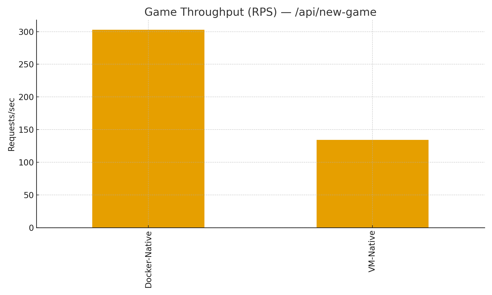
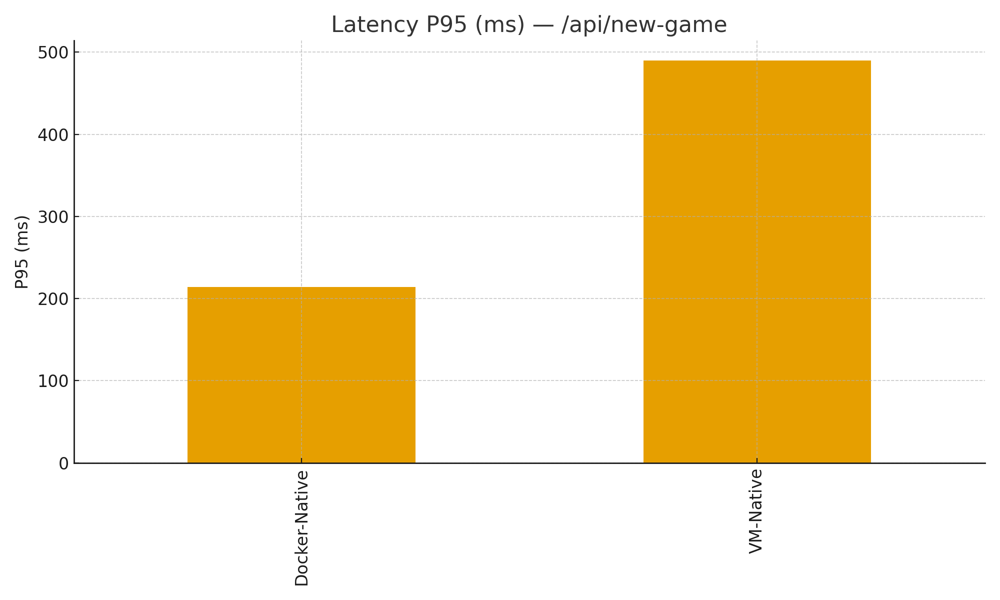
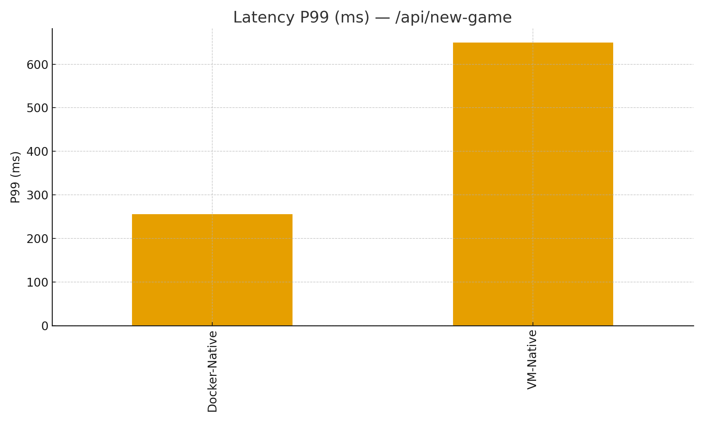

# Terramino — VM-Native vs Docker-Native Assignment Report
_Generated: 2025-09-08 06:38:40Z_

Repository: {{GITHUB_REPO_URL}}


**Demo video:** [game-vm-docker.mp4](reports/media/game-vm-docker.mp4)


## 1. Overview
Two alternative deployment solutions are provided and benchmarked:

- **VM-Native:** Ubuntu LTS with system services (redis-server, nginx, Prometheus, Grafana, node_exporter). Backend & frontend run as systemd services.
- **Docker-Native:** Single Docker Swarm stack (redis, backend, frontend, prometheus, grafana, node-exporter, cAdvisor, redis_exporter). Auto-started with Vagrant docker provider wrapper.

### Quick Links (local paths)
- Report: `ASSIGNMENT_REPORT.md` (this file)
- Detailed benchmark report: `reports/game_compare_report.md`
- Charts: `reports/charts/`
- Media: `reports/media/`

## 2. How to Run

### Docker-Native (localhost)
```powershell
# Build local images and deploy stack (already done if you followed earlier steps)
docker build -t terramino-backend:local app/backend
docker build -t terramino-frontend:local app/frontend
docker swarm init 2>$null || true
docker stack deploy -c docker/docker-stack.yml terramino
# Open: http://localhost:8080 , Prom: http://localhost:9090 , Grafana: http://localhost:3000
```

### VM-Native (VirtualBox host-only 192.168.56.50)
```powershell
vagrant up vm-native
# Open: http://192.168.56.50 , Prom: http://192.168.56.50:9090 , Grafana: http://192.168.56.50:3000
```

## 3. Functional Tests
PowerShell:
```powershell
python -m pip install --user requests
.	estsunctional
un.ps1 -FrontendUrl http://localhost:8080 -BackendUrl http://localhost:8081 -PromUrl http://localhost:9090 -GrafanaUrl http://localhost:3000
.	estsunctional
un.ps1 -FrontendUrl http://192.168.56.50 -BackendUrl http://192.168.56.50:8081 -PromUrl http://192.168.56.50:9090 -GrafanaUrl http://192.168.56.50:3000
```
Produces JUnit XML under `reports/functional/`.

## 4. Benchmarks — Game `/api/new-game`
**Summary (averages across runs):**
| stack         |   concurrency |   duration_s |   total_requests |   success |   errors |   success_rate_% |    rps |   p50_ms |   p95_ms |   p99_ms |   mean_ms |
|:--------------|--------------:|-------------:|-----------------:|----------:|---------:|-----------------:|-------:|---------:|---------:|---------:|----------:|
| Docker-Native |            50 |           15 |             4543 |      4543 |        0 |              100 | 302.87 |   158.2  |   214.4  |   256.06 |    164.95 |
| VM-Native     |            50 |           15 |             2013 |      2013 |        0 |              100 | 134.2  |   374.33 |   489.98 |   649.86 |    375.48 |

**Head-to-head deltas:**
- **RPS:** Docker vs VM = +125.7%
- **P95 latency:** VM vs Docker = +128.5% (positive = VM slower)
- **P99 latency:** VM vs Docker = +153.8% (positive = VM slower)

**Charts:**




_Missing: reports/charts/boot_ready_compare.png_

To add more runs, use:
```powershell
PowerShell -NoProfile -ExecutionPolicy Bypass -File .	estsenchmark\game_bench.ps1 `
  -Target http://localhost:8081 -DurationSec 15 -Concurrency 50 -Out .
eportsenchmarks\game_results.csv
PowerShell -NoProfile -ExecutionPolicy Bypass -File .	estsenchmark\game_bench.ps1 `
  -Target http://192.168.56.50:8081 -DurationSec 15 -Concurrency 50 -Out .
eportsenchmarks\game_vm.csv
python .
eports\charts.py
```

## 5. Boot Time (Time-to-Ready)
Run the boot measurement scripts to populate `reports/boot/boot_times.csv` and re-generate the chart.

Measure and append rows:
```powershell
PowerShell -NoProfile -ExecutionPolicy Bypass -File .\scripts\measure-boot.ps1 -Stack docker -Rebuild
PowerShell -NoProfile -ExecutionPolicy Bypass -File .\scripts\measure-boot.ps1 -Stack vm -VmName vm-native -Rebuild `
  -FrontendUrl http://192.168.56.50 -BackendUrl http://192.168.56.50:8081 -PromUrl http://192.168.56.50:9090 -GrafanaUrl http://192.168.56.50:3000
python .
eports\charts.py
```

## 6. Observability
- Prometheus jobs: backend, redis, node, cadvisor (Docker-Native), redis_exporter.
- Grafana: pre-provisioned dashboards (App, Redis, Host/Containers). JSON is under `docker/grafana/dashboards/` and `app/*` (if any app-specific panels).

## 7. Packaging for Consumers
- **Docker images** → `.\scripts\export-docker-images.ps1` (saves `terramino-backend:local` and `terramino-frontend:local` to `dist/` with checksums)
- **Vagrant boxes** → `.\scripts\package-vagrant.ps1` (builds `.box` files into `dist/`)

## 8. Publish to GitHub

1. Create a new empty repo (or use an existing URL).  
   Example: `https://github.com/yourname/terramino-infra`

2. From the project root, run:
```powershell
.\scripts\publish\init-and-push.ps1 -RepoUrl "https://github.com/yourname/terramino-infra.git"
```

3. (Optional) Create a Release with artifacts using GitHub CLI (if installed):
```powershell
.\scripts\publish\gh-release.ps1 -Tag v1.0.0 -Name "Terramino Infra 1.0.0" -NotesFile .\ASSIGNMENT_REPORT.md
```

After pushing, replace the placeholder below with your repo URL:

**Repository:** {{GITHUB_REPO_URL}}

## 9. Appendix
- System limits (systemd & Compose) are documented inline in service files / stack YAML.
- Security: non-root services where applicable; UFW optional (commented); dummy secrets via `.env.example`.
- Troubleshooting: See `README_TESTS_CI.md` for Windows notes (ExecutionPolicy, find `make`, etc.).


## 6.a Monitoring & Virtualization Evidence (Screenshots)

_Added on 2025-09-08 06:56:15Z_

The images below demonstrate that **monitoring and virtualization** are incorporated in the images:

- **Grafana dashboards** (App, Redis, Host) show application KPIs (games/sec, requests/sec), Redis ops/clients, and host CPU/memory trends, fed by Prometheus scraping backend, redis_exporter, node_exporter (and cAdvisor for Docker-Native).
- **Virtualization**: Both **VM-Native (VirtualBox)** and **Docker-Native (Swarm on Docker Desktop)** deployments are running concurrently; dashboards reflect activity from each when targeted via Prometheus jobs.

- **Grafana App Overview**  
  
- **Grafana Redis Overview**  
  
- **Grafana Host Overview**  
  
