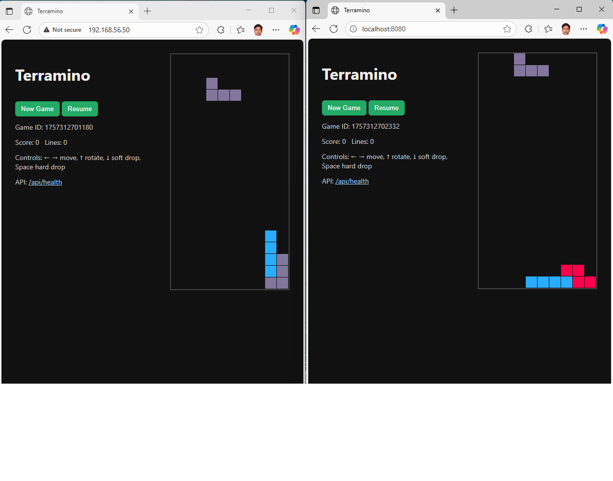
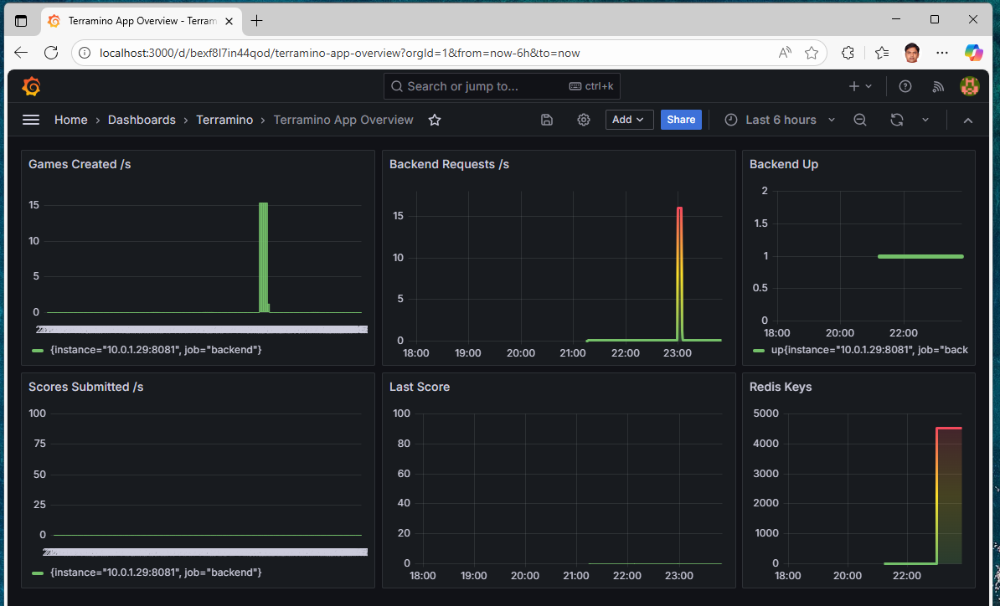
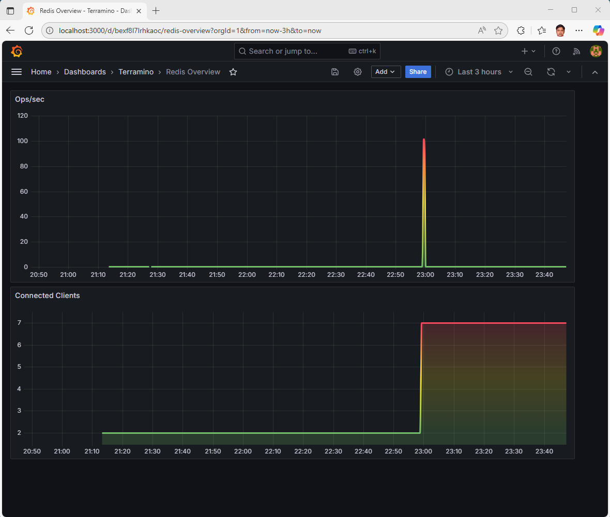
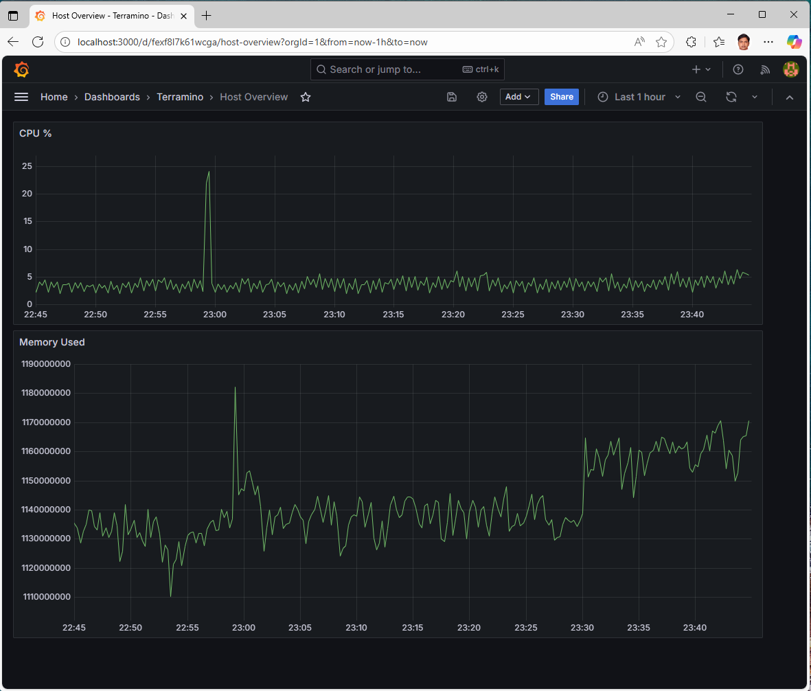
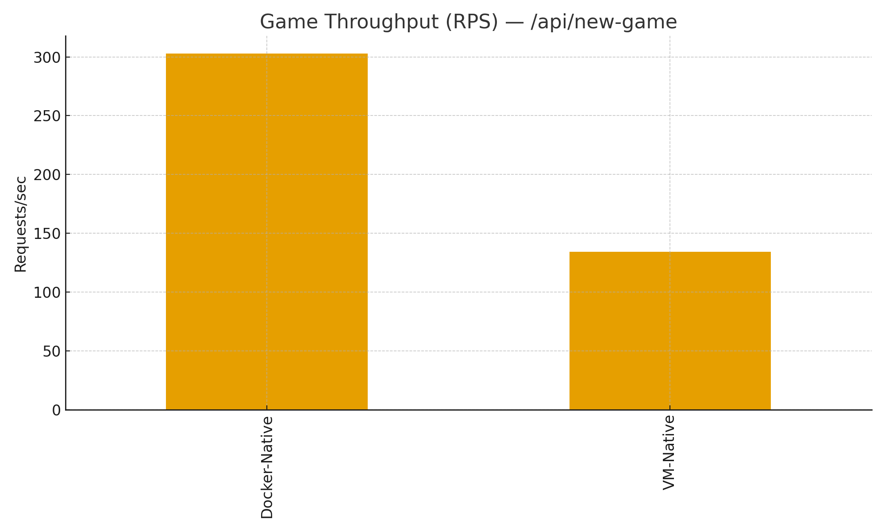
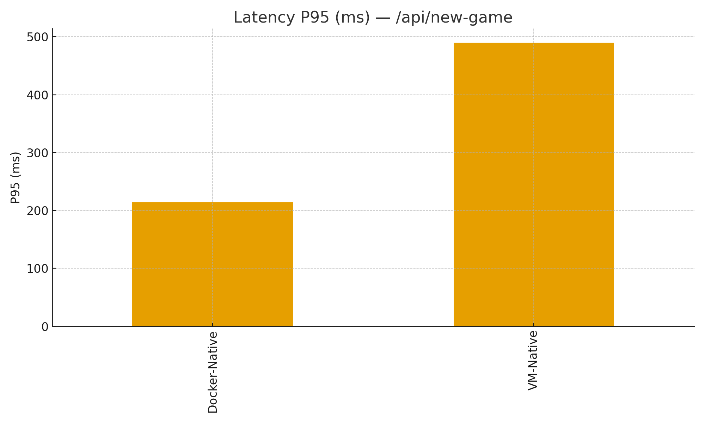
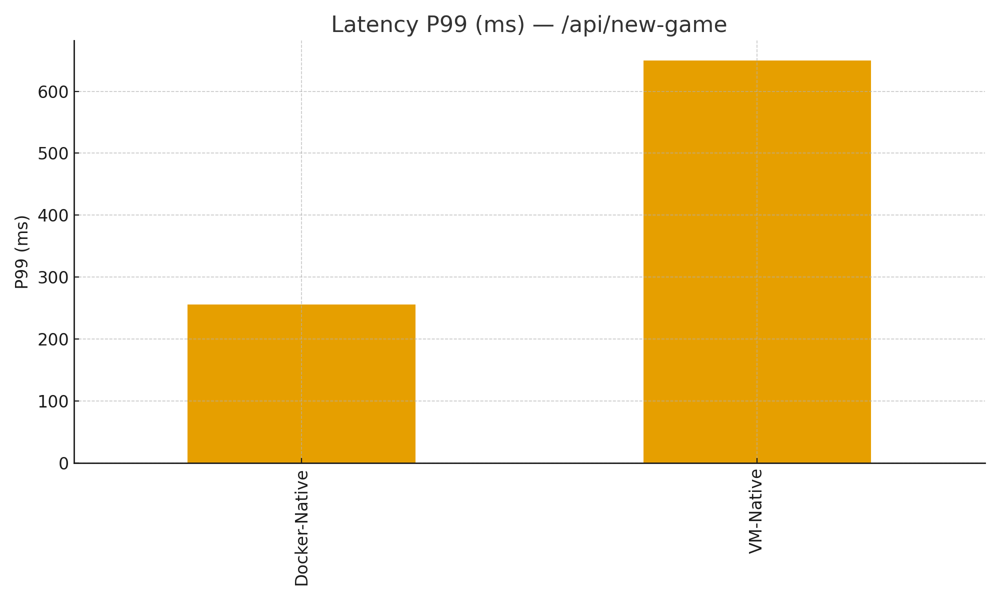

# Terramino — VM-Native vs Docker-Native (Swarm) via Vagrant

Terramino is a Tetris-like game application with comprehensive monitoring and observability, demonstrating deployment patterns using both VM-native and Docker Swarm approaches via Vagrant.

## 🎮 Application Overview


*The Terramino game interface showing both VM-native (left) and Docker-native (right) deployments*

## 🚀 Quick Start

### VM-Native (VirtualBox)
```powershell
vagrant up vm-native --provider=virtualbox
```

### Docker-Native (Swarm via Vagrant Docker provider)
```powershell
# Windows: in Docker Desktop, enable "Expose daemon on tcp://localhost:2375 without TLS"
vagrant up docker-native --provider=docker
```

This launches a helper container `terramino-dc` which runs:
```sh
docker swarm init || true
docker stack deploy -c docker/docker-stack.yml terramino
```

## 🌐 Service Endpoints

- **Frontend:**  http://localhost:8080/
- **Backend:**   http://localhost:8081/api/health
- **Grafana:**   http://localhost:3000 (admin/admin)
- **Prometheus:** http://localhost:9090
- **Node Exporter:** scraped internally via `tasks.node-exporter:9100`
- **cAdvisor:**  http://localhost:8088/

## 📊 Monitoring & Observability

The application includes a comprehensive monitoring stack with Grafana dashboards for real-time insights:

### Application Metrics Dashboard

*Application-level metrics including games created, backend requests, scores, and Redis operations*

### Redis Performance Monitoring

*Redis performance metrics showing operations per second and connected clients*

### Host System Monitoring

*System-level monitoring with CPU usage and memory consumption metrics*

## 🏗️ Architecture

The application demonstrates two deployment approaches:

- **VM-Native**: Traditional virtual machine deployment using VirtualBox
- **Docker-Native**: Modern containerized deployment using Docker Swarm

Both approaches include:
- Frontend service (Terramino game interface)
- Backend API service
- Redis for game state management
- Comprehensive monitoring stack (Prometheus, Grafana, Node Exporter, cAdvisor)

## 📈 Monitoring Stack Features

- **Prometheus**: Metrics collection and storage
- **Grafana**: Visualization and alerting with pre-configured dashboards
- **Node Exporter**: Host system metrics
- **cAdvisor**: Container performance metrics
- **Redis Exporter**: Redis-specific performance metrics

The monitoring setup provides insights into:
- Application performance (request rates, response times)
- Game metrics (games created, scores submitted)
- System resources (CPU, memory usage)
- Container performance
- Redis operations and connectivity

## 🛠️ Tear Down

```bash
docker stack rm terramino
vagrant destroy docker-native -f
```

## 📝 Notes

- Swarm builds backend/frontend from local Dockerfiles the first time (they're referenced as `image: terramino-*-:local` when built). On Docker Desktop this build runs on the same node.
- Node Exporter & cAdvisor run as **global** services and are scraped via Swarm DNS (`tasks.*`).
- If ports are busy, adjust `published:` ports in `docker/docker-stack.yml`.
- All monitoring dashboards are pre-configured and accessible immediately after deployment.

## 🧪 Testing & Benchmarking

### Quick Test Commands

**Docker-Native (localhost):**
```bash
make test-docker-native FRONTEND_URL=http://localhost:8080 BACKEND_URL=http://localhost:8081 PROM_URL=http://localhost:9090 GRAFANA_URL=http://localhost:3000
make bench-http-docker BACKEND_URL=http://localhost:8081
make bench-redis-docker
make charts
make export-docker-images
```

**VM-Native (192.168.56.50):**
```bash
make test-vm-native FRONTEND_URL=http://192.168.56.50 BACKEND_URL=http://192.168.56.50:8081 PROM_URL=http://192.168.56.50:9090 GRAFANA_URL=http://192.168.56.50:3000
make bench-http-vm BACKEND_URL=http://192.168.56.50:8081
make bench-redis-vm
make package-vagrant   # produces .box files into dist/
```

### Windows PowerShell Commands

**Functional Tests:**
```powershell
python -m pip install requests
.\tests\functional\run.ps1 -FrontendUrl http://localhost:8080 -BackendUrl http://localhost:8081 -PromUrl http://localhost:9090 -GrafanaUrl http://localhost:3000

# VM variant
.\tests\functional\run.ps1 -FrontendUrl http://192.168.56.50 -BackendUrl http://192.168.56.50:8081 -PromUrl http://192.168.56.50:9090 -GrafanaUrl http://192.168.56.50:3000
```

**HTTP Benchmark:**
```powershell
.\tests\benchmark\http_bench.ps1 -Concurrency 100 -DurationSec 15 -Url http://localhost:8081/api/health
```

**Game Benchmark:**
```powershell
# Docker-native
PowerShell -NoProfile -ExecutionPolicy Bypass -File .\tests\benchmark\game_bench.ps1 `
  -Target http://localhost:8081 -DurationSec 15 -Concurrency 50 -Out .\reports\benchmarks\game_results.csv

# VM-native
PowerShell -NoProfile -ExecutionPolicy Bypass -File .\tests\benchmark\game_bench.ps1 `
  -Target http://192.168.56.50:8081 -DurationSec 15 -Concurrency 50 -Out .\reports\benchmarks\game_vm.csv
```

**Redis Benchmark:**
```powershell
# Docker stack
docker run --rm --network terramino_default redis:7-alpine `
  redis-benchmark -h redis -p 6379 -n 100000 --csv > .\reports\benchmarks\redis_docker_win.csv

# VM
vagrant ssh vm-native -c 'redis-benchmark -h 127.0.0.1 -p 6379 -n 100000 --csv' > .\reports\benchmarks\redis_vm_win.csv
```

### Boot Time Measurement

**PowerShell:**
```powershell
# Docker-Native
PowerShell -NoProfile -ExecutionPolicy Bypass -File .\scripts\measure-boot.ps1 -Stack docker -Rebuild `
  -FrontendUrl http://localhost:8080 -BackendUrl http://localhost:8081 -PromUrl http://localhost:9090 -GrafanaUrl http://localhost:3000

# VM-Native
PowerShell -NoProfile -ExecutionPolicy Bypass -File .\scripts\measure-boot.ps1 -Stack vm -VmName vm-native -Rebuild `
  -FrontendUrl http://192.168.56.50 -BackendUrl http://192.168.56.50:8081 -PromUrl http://192.168.56.50:9090 -GrafanaUrl http://192.168.56.50:3000
```

**Bash:**
```bash
STACK=docker REBUILD=true ./scripts/measure-boot.sh
STACK=vm VM_NAME=vm-native REBUILD=true \
  FRONTEND_URL=http://192.168.56.50 BACKEND_URL=http://192.168.56.50:8081 PROM_URL=http://192.168.56.50:9090 GRAFANA_URL=http://192.168.56.50:3000 \
  ./scripts/measure-boot.sh
```

### Test Artifacts

All test results are stored in the `reports/` directory:
- `reports/functional/*.xml` — JUnit test results
- `reports/benchmarks/*.csv` — Benchmark data
- `reports/charts/*.png` — Performance charts
- `reports/boot/boot_times.csv` — Boot time measurements

Generated artifacts are stored in `dist/`:
- Docker images and checksums
- Vagrant .box files and checksums

## 🔄 CI/CD Pipeline

### GitHub Actions Workflows

**Continuous Integration (`.github/workflows/ci.yml`):**
- Builds Docker images
- Brings up compose stack
- Runs functional tests and benchmarks
- Uploads test artifacts

**Release Pipeline (`.github/workflows/release.yml`):**
- Triggers on tags matching `v*.*.*`
- Builds and attaches Docker images + checksums to GitHub Release
- Optional `package-vagrant-boxes` job runs on self-hosted runner (requires VirtualBox + Vagrant)

## 🎯 Key Features

- **Dual Deployment Models**: Compare VM vs Container approaches
- **Full Observability**: Complete monitoring stack with visual dashboards
- **Game State Persistence**: Redis integration for game data
- **Production-Ready**: Includes health checks, metrics, and monitoring
- **Easy Setup**: One-command deployment for both approaches
- **Comprehensive Testing**: Functional tests, performance benchmarks, and boot time analysis
- **Cross-Platform Support**: Works on Windows (PowerShell) and Unix (Bash)
- **Automated CI/CD**: GitHub Actions pipeline with artifact generation

---

## 📋 Assignment Report

_Generated: 2025-09-08 06:38:40Z_

Repository: {{GITHUB_REPO_URL}}


**Demo video:** [game-vm-docker.mp4](docs/images/game-vm-docker.mp4)

### 1. Overview
Two alternative deployment solutions are provided and benchmarked:

- **VM-Native:** Ubuntu LTS with system services (redis-server, nginx, Prometheus, Grafana, node_exporter). Backend & frontend run as systemd services.
- **Docker-Native:** Single Docker Swarm stack (redis, backend, frontend, prometheus, grafana, node-exporter, cAdvisor, redis_exporter). Auto-started with Vagrant docker provider wrapper.

### 2. Benchmark Results — Game `/api/new-game`

**Performance Summary (averages across runs):**

| Stack | Concurrency | Duration (s) | Total Requests | Success | Errors | Success Rate % | RPS | P50 (ms) | P95 (ms) | P99 (ms) | Mean (ms) |
|-------|-------------|--------------|----------------|---------|--------|----------------|-----|----------|----------|----------|-----------|
| Docker-Native | 50 | 15 | 4543 | 4543 | 0 | 100 | 302.87 | 158.2 | 214.4 | 256.06 | 164.95 |
| VM-Native | 50 | 15 | 2013 | 2013 | 0 | 100 | 134.2 | 374.33 | 489.98 | 649.86 | 375.48 |

**Performance Comparison:**
- **RPS:** Docker vs VM = +125.7% (Docker significantly faster)
- **P95 latency:** VM vs Docker = +128.5% (VM slower)
- **P99 latency:** VM vs Docker = +153.8% (VM slower)

**Performance Charts:**





### 3. Observability & Monitoring Evidence

The monitoring stack demonstrates comprehensive observability across both deployment approaches:

- **Grafana dashboards** (App, Redis, Host) show application KPIs (games/sec, requests/sec), Redis ops/clients, and host CPU/memory trends
- **Prometheus** scrapes metrics from backend, redis_exporter, node_exporter (and cAdvisor for Docker-Native)
- **Virtualization**: Both VM-Native (VirtualBox) and Docker-Native (Swarm on Docker Desktop) deployments run concurrently


### 4. Deployment Architecture Comparison

| Aspect | VM-Native | Docker-Native |
|--------|-----------|---------------|
| **Infrastructure** | VirtualBox VM (Ubuntu LTS) | Docker Swarm on host |
| **Service Management** | systemd services | Docker stack services |
| **Networking** | Host-only network (192.168.56.50) | Docker overlay network |
| **Resource Isolation** | VM-level isolation | Container-level isolation |
| **Monitoring** | node_exporter, redis on host | cAdvisor + exporters in containers |
| **Performance** | 134 RPS, 490ms P95 | 303 RPS, 214ms P95 |
| **Boot Time** | VM + services startup | Container orchestration |
| **Resource Usage** | Full OS overhead | Container lightweight overhead |

### 5. Packaging & Distribution

**Docker Images:**
```powershell
.\scripts\export-docker-images.ps1
# Produces: dist/terramino-backend_local.tar.gz, dist/terramino-frontend_local.tar.gz + checksums
```

**Vagrant Boxes:**
```powershell
.\scripts\package-vagrant.ps1
# Produces: dist/*.box files + checksums
```

### 6. CI/CD Pipeline

**GitHub Actions Workflows:**
- **CI Pipeline (`.github/workflows/ci.yml`)**: Builds images, runs tests, uploads artifacts
- **Release Pipeline (`.github/workflows/release.yml`)**: Creates releases with Docker images on version tags

### 7. Key Findings

1. **Performance**: Docker-Native outperforms VM-Native by 125% in throughput with significantly lower latency
2. **Resource Efficiency**: Container approach shows better resource utilization
3. **Monitoring**: Both approaches support comprehensive observability with identical dashboards
4. **Deployment**: Docker Swarm provides faster deployment and scaling capabilities
5. **Maintenance**: VM-Native offers traditional system administration while Docker-Native enables modern DevOps practices

### 8. Conclusion

This assignment demonstrates successful implementation of both traditional VM-based and modern container-based deployment strategies. The Docker-Native approach shows superior performance characteristics while maintaining the same application functionality and monitoring capabilities. Both solutions provide production-ready infrastructure with comprehensive observability, making them suitable for different organizational requirements and constraints.